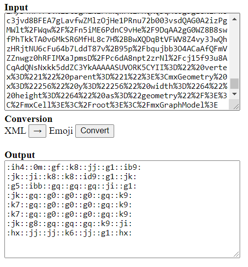

# drawio-redstone
Redstone emoji library for Draw.io and a tool for converting Draw.io <> Discord emojis.  

The redstone emojis are made by cmoa#8392.

[Github page](https://towsti.github.io/drawio-redstone)

## Features

- Draw.io redstone library: https://towsti.github.io/drawio-redstone/All.xml
- [Conversion tool](Converter/index.html) for converting Draw.io selection <> Discord emojis

## Draw.io library import

1. Open an existing Draw.io file or create a new file
2. Set the grid size to 64p
3. `File` >  `Open Library from` > `URL...`
4. Use the following URL: https://towsti.github.io/drawio-redstone/All.xml
5. Click `Open`

## Converter tool

The [conversion tool](Converter/index.html) is used to convert between a Draw.io selection and Discord emojis.

### Emoji > Draw.io

1. Open the conversion tool and set the conversion to "Emoji > Draw.io"

2. Paste the Emoji data in the input field

3. Click `Convert`

4. Copy the output selection and paste it in a Draw.io file

   

   *The selection is always placed on 0,0 in the Draw.io file and overwrite any existing selection.

## Draw.io > Emoji

1. Select the part that will be converted

   - Can contain non-filled areas
   - Cannot contain fields/images that are not part of the redstone image/emoji library
   - Currently cannot contain rotated redstone images

   

2. Copy <kbd>CTRL</kbd>+<kbd>C</kbd> the selection

3. Open the conversion tool and set the conversion to "Draw.io > Emoji" 

4. Paste <kbd>CTRL</kbd>+<kbd>v</kbd> the selection in the input field

5. Click `Convert`

6. Copy the output selection and paste it discord

   

## Development

**updating image library**

1. Clone the [repository](https://github.com/Towsti/temp-test.git)
2. Modify/add/remove images in the "Emojis/All" folder
   - Images <u>must</u> be 64*64 pixels and ".png" format
3. Create a new library from any Draw.io library from the updated "Emojis/All" folder
4. Overwrite the existing "All.xml" with the new xml library
5. Update `const ALL` "in Converter/logic.js"
6. Commit and push the changes 

## TODO

- Possibly, fork drawio-desktop and add direct support for the image library and conversion
- Rotation table for Draw.io > emoji conversion to allow rotating images in Draw.io and a "Minimal.xml" library
- Optimize Draw.io > emoji conversion (improve reliability for grid sizes other than 64p)
- Discord emoji preview window

